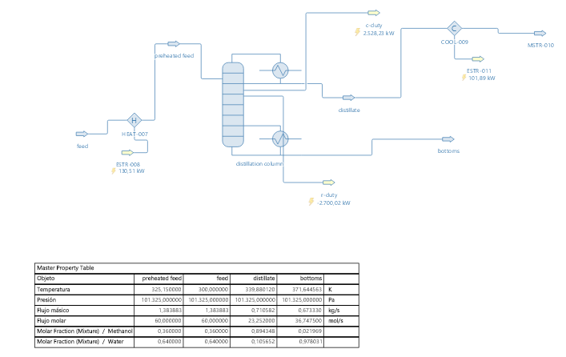

# Literature Case 102 - Methanol Water Distillation

Baseline documental y de simulación del Caso 102 del **DWSIM Flowsheeting
Project de FOSSEE, IIT Bombay**, aportado por Rahul A S (SASTRA Deemed
University, 2018). Este caso abre la línea `Literature_cases`: estudiar
ejemplos existentes antes de crear nuevas variantes.

> Estado: `SOURCE_BASELINE_VERIFIED`. Los archivos FOSSEE son íntegros, pero
> todavía no se ha reconvergido el flowsheet en DWSIM 9.0.5 ni se ha realizado
> una validación científica externa.

## Pregunta ingenieril

¿Cómo separa una columna binaria una alimentación de metanol-agua y cuánto
cambian sus predicciones cuando se conserva el modelo ideal original o se usa
un modelo de coeficientes de actividad apropiado para una mezcla polar?

El abstract describe 60 mol/s con 36 mol% de metanol y 64 mol% de agua a 300 K
y 1 atm. La corriente se precalienta a 325 K, entra en la cuarta etapa y la
columna opera con relación de reflujo 2. El objetivo declarado es obtener cerca
de 90 mol% de metanol en cabeza y 97 mol% de agua en fondos.



## Baseline FOSSEE inmutable

| Archivo | Tamaño | SHA-256 |
|---|---:|---|
| `Abstracts.pdf` | 8 491 B | `d04f3faeec4c23f33d99e2ff036a397f18d1ebca70a911432b093f0a92852c53` |
| `MethanolDistillation.dwxmz` | 26 455 B | `b262eb9b3d00d641189e913620cf4ef27b6651188be9a006293f5e947eee5498` |

Ambos archivos son copias byte a byte del Caso 102 en el corpus local ignorado.
No deben abrirse y guardarse sobre sí mismos. Una nueva ejecución se inicia
siempre desde una copia ubicada en `variants/`.

## Evidencia de versión

La ficha oficial informa **DWSIM v6.5 (Classic UI)**. El XML dentro del
`.dwxmz` contiene `BuildVersion 5.5.6886.34470`, fecha de build
`2018-11-08` y guardado `2018-12-11T14:43:40+05:30`. La discrepancia queda
registrada; no se elige una versión como verdadera sin evidencia adicional.

El modelo guardado usa **Raoult's Law**, ocho etapas y los componentes Methanol
y Water. Raoult supone idealidad líquida; por ello sirve como baseline de
paridad, no como autoridad para el VLE real de una mezcla alcohol-agua.

## Secuencia de trabajo

1. verificar hashes del baseline;
2. crear manualmente una copia en DWSIM 9.0.5 conservando Raoult;
3. comparar topología, especificaciones, convergencia, balances, purezas,
   temperaturas, perfiles y deberes térmicos;
4. crear una segunda variante separada con NRTL u otro modelo justificado;
5. contrastar VLE y resultados con literatura o datos experimentales;
6. explicar las diferencias físicas sin modificar el baseline.

La primera variante pendiente debe ubicarse bajo
`variants/dwsim_9_0_5/parity_raoult/`. Las variantes NRTL/UNIQUAC sólo se
promueven después de documentar parámetros y fuente.

## Reproducibilidad

```bash
python scripts/validate_literature_case.py \
  "Literature_cases/102 - Methanol_Water_Distillation_By_Mr_Rahul_A_S"
```

La comparación local opcional con el corpus se documenta en
[el índice Literature](../README.md). Consulte también
[el informe de validación](./validation_report.md),
[el manifiesto fuente](./source_manifest.json) y
[la procedencia](./provenance.json).

## Autoría y licencia

Fuente: FOSSEE, IIT Bombay, DWSIM Flowsheeting Project, Caso 102, contributor
Rahul A S, SASTRA Deemed University, 2018. La ficha del proyecto declara
licencia CC BY-SA 4.0. El PDF contiene `Rahul Nagraj` en sus metadatos; se
registra como discrepancia de metadatos y no reemplaza la atribución oficial.
