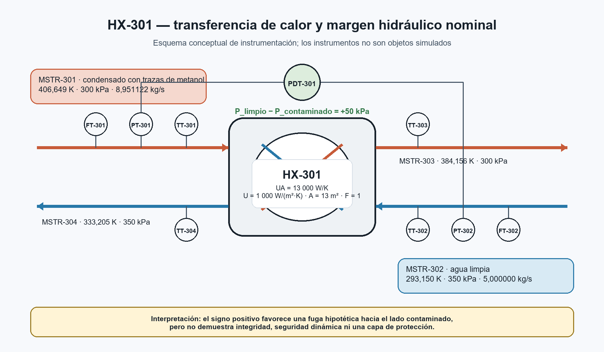
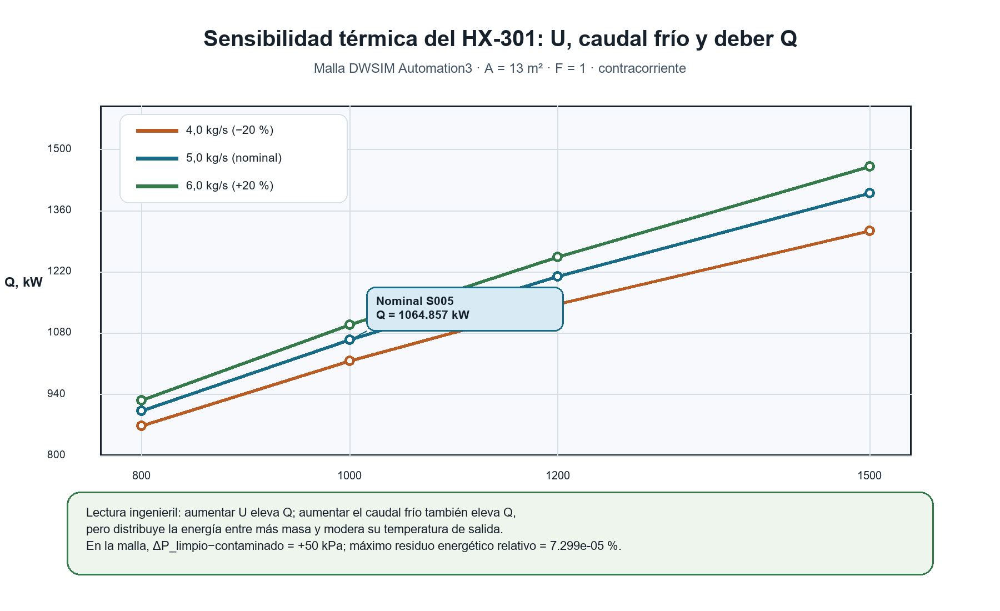

# 004_control_contaminacion_cruzada_validacion_cruzada — Control de contaminación cruzada y validación cruzada de HX-301

> **Status:** `review`
> **Versión:** `0.1.0`
> **Veredicto esperado:** `CONDITIONAL`
> **Aviso de datos:** escenario sintético y resultados simulados; no contiene
> datos de una instalación real ni constituye validación de seguridad.

## 1. Fenómeno

El caso estudia dos ideas relacionadas, pero no equivalentes:

1. la transferencia de calor sensible entre condensado con trazas de metanol y
   agua limpia mediante un intercambiador contracorriente descrito por un
   producto global `UA`;
2. el signo del diferencial de presión
   `ΔP_limpio = P_limpio - P_contaminado` como tamiz nominal de la dirección de
   una fuga hipotética.

El flowsheet continúa el Caso 003, pero corrige su parametrización térmica de
`U = 12975.4 W/(m²·K), A = 1 m²` a `U = 1000 W/(m²·K), A = 13 m²` y eleva la
presión de entrada del agua limpia desde 300000 hasta 350000 Pa. No se modifica
el Caso 003 ni se sustituye su escenario histórico de margen nulo.

```text
 MSTR-301_CONDENSADO_CALIENTE, 300 kPa
                    ────────────────┐
                                    v
                              [ HX-301 ] ──> MSTR-303_CONDENSADO_ENFRIADO
                                    ^
                    ────────────────┘
 MSTR-302_AGUA_FRIA, 350 kPa            MSTR-304_AGUA_PRECALENTADA
```

## 2. Pregunta de ingeniería

¿Puede reproducirse el desempeño térmico nominal de HX-301 con un valor de `U`
plausible para el estudio y un área coherente, al tiempo que se demuestra un
margen nominal positivo de 50000 Pa sin confundir ese resultado con rating
geométrico, integridad mecánica o seguridad operacional?

## 3. Fundamento científico

Para flujo contracorriente:

\[
\Delta T_1=T_{h,in}-T_{c,out},\qquad
\Delta T_2=T_{h,out}-T_{c,in}
\]

\[
LMTD=\frac{\Delta T_2-\Delta T_1}
{\ln(\Delta T_2/\Delta T_1)}
\]

\[
\dot Q=U\,A\,F\,LMTD
\]

La conservación de energía se contrasta por ambos lados:

\[
\dot Q_h=\dot m_h(h_{h,in}-h_{h,out}),\qquad
\dot Q_c=\dot m_c(h_{c,out}-h_{c,in})
\]

El tamiz hidráulico se define como:

\[
\Delta P_{limpio}=P_{limpio,in}-P_{contaminado,in}
\]

Un valor positivo orientaría una fuga idealizada desde el lado limpio hacia el
contaminado. No demuestra por sí solo que exista margen suficiente durante
transitorios, que la presión local sea la misma que en las entradas ni que el
equipo conserve su integridad.

## 4. Modelo de ingeniería

El archivo fue creado manualmente en DWSIM 9.0.5 y verificado mediante la
Automation API sobre una copia temporal. La fuente permaneció inalterada.

| Configuración | Valor guardado |
|---|---:|
| Paquete termodinámico | NRTL |
| Modo del intercambiador | `CalcBothTemp_UA` |
| Dirección de flujo | Contracorriente |
| U | 1000 W/(m²·K) |
| A | 13 m² |
| F | 1 |
| ΔP interno, lado caliente | 0 Pa |
| ΔP interno, lado frío | 0 Pa |
| Uso de geometría shell-and-tube | `false` |

Aunque DWSIM identifica el objeto como intercambiador, el archivo tiene
`UseShellAndTubeGeometryInformation=false`. En consecuencia, este caso es un
modelo global UA y no un rating mecánico o geométrico de carcasa y tubos.



La figura es un apoyo explicativo. PT, TT, FT y PDT representan una propuesta
de observabilidad; no son objetos incluidos en el flowsheet.

La modificación mantiene casi constante el producto UA:

| Escenario | U, W/(m²·K) | A, m² | UA, W/K |
|---|---:|---:|---:|
| Caso 003 | 12975.4 | 1.0 | 12975.4 |
| Caso 004 | 1000.0 | 13.0 | 13000.0 |

Por ello, obtener nuevamente aproximadamente 1.065 MW es una
**reparametrización circular de UA**, no una validación independiente de `U`,
`A` o `Q`.

## 5. Entradas y resultados verificados

Los siguientes valores proceden del archivo resuelto y de la extracción API;
no se sustituyen por los valores preliminares 453.15/303.15 K de las
instrucciones de construcción, incompatibles con el punto térmico finalmente
guardado.

| Corriente | T, K | P, Pa | ṁ, kg/s | h, kJ/kg |
|---|---:|---:|---:|---:|
| `MSTR-301_CONDENSADO_CALIENTE` | 406.649350 | 300000 | 8.951122 | -2052.326970 |
| `MSTR-302_AGUA_FRIA` | 293.150000 | 350000 | 5.000000 | -2656.953827 |
| `MSTR-303_CONDENSADO_ENFRIADO` | 384.156248 | 300000 | 8.951122 | -2171.290466 |
| `MSTR-304_AGUA_PRECALENTADA` | 333.204676 | 350000 | 5.000000 | -2443.982477 |

| Indicador | Resultado |
|---|---:|
| Carga térmica DWSIM | 1064.856763 kW |
| LMTD DWSIM | 81.912059 K |
| LMTD reconstruida | 81.911940 K |
| `Q_hot` por entalpías | 1064.856763 kW |
| `Q_cold` por entalpías | 1064.856752 kW |
| Residuo `Q_hot-Q_cold` | 0.000011214 kW |
| Margen limpio-contaminado | +50000 Pa |

La malla Automation3 resolvió los 12 escenarios definidos por
`U={800, 1000, 1200, 1500} W/(m²·K)` y caudal frío `{4, 5, 6} kg/s`.
`Q` aumentó monótonamente con ambas variables, desde 867.678 hasta
1461.455 kW. El máximo residuo energético relativo fue
`7.299×10⁻⁵ %`.



La figura muestra dos mecanismos: un `U` mayor intensifica el intercambio,
mientras un caudal frío mayor eleva la capacidad térmica de ese lado y permite
transferir más calor con un aumento de temperatura menor por unidad de masa.

## 6. Evidencia y advertencias

- El runner local resolvió el flowsheet, extrajo los cinco objetos solicitados
  y verificó que el SHA-256 de la fuente no cambió.
- El checksum del archivo versionado es
  `e62493025e33114466e1af735c5916eb73eaa92d36ea6d2419e456875d0a181e`.
- La inicialización de Automation emitió una advertencia no fatal al enumerar
  el complemento ThermoCS; la simulación NRTL sí fue resuelta.
- El archivo conserva mensajes de cambio de fase en el lado caliente y una
  fracción másica de vapor de aproximadamente `8.08×10⁻⁶` en la entrada. DWSIM
  describe el cálculo de intercambio como una aproximación.
- No existe evidencia calorimétrica experimental independiente. Los balances
  y el cierre UA demuestran coherencia computacional, no exactitud frente a una
  medición física.
- El lado frío implica `cp_efectiva = 5.317 kJ/(kg·K)`; el Caso 001 con
  Steam Tables/IAPWS implica `4.179 kJ/(kg·K)` en un intervalo térmico
  cercano. La diferencia de 27.22 % es una señal de revisión de propiedades,
  no una comparación estrictamente equivalente ni un error demostrado.

## 7. Procedimiento reproducible

Desde la raíz del repositorio:

```bash
python scripts/validate_metadata.py cases/004_control_contaminacion_cruzada_validacion_cruzada
python scripts/validate_tables.py cases/004_control_contaminacion_cruzada_validacion_cruzada
python scripts/unit_consistency_check.py cases/004_control_contaminacion_cruzada_validacion_cruzada
python scripts/compute_checksums.py --verify cases/004_control_contaminacion_cruzada_validacion_cruzada
python scripts/validate_case.py cases/004_control_contaminacion_cruzada_validacion_cruzada --source dataset
python cases/004_control_contaminacion_cruzada_validacion_cruzada/scripts/extract_saved_results.py
python cases/004_control_contaminacion_cruzada_validacion_cruzada/scripts/sensitivity_hx301.py
python cases/004_control_contaminacion_cruzada_validacion_cruzada/scripts/generate_figures.py
```

La paridad externa del Caso 002 se reproduce con:

~~~bash
python cases/004_control_contaminacion_cruzada_validacion_cruzada/scripts/parity_check_002.py --output cases/004_control_contaminacion_cruzada_validacion_cruzada/data/processed/case002_api_parity_v01.csv
~~~

El código de salida actual es `1` porque la discrepancia energética excede la
tolerancia; ese resultado adverso es la evidencia esperada, no un fallo de
ejecución del script.

La verificación local con DWSIM se ejecuta con:

```bash
python scripts/validate_case.py cases/004_control_contaminacion_cruzada_validacion_cruzada --source dwsim --write-artifacts
```

`validation_results.json` fue generado por el motor de validación; no se
edita manualmente. Los criterios sin evidencia independiente permanecen
`NOT_RUN`, por lo que el resultado general es `CONDITIONAL`.

## 8. Validación cruzada ejecutada y pendiente

La sensibilidad de `U` y caudal frío ya fue ejecutada y versionada con
12/12 escenarios convergidos. Las siguientes actividades aún no sustentan un
`PASS`:

- comparación de coeficientes de actividad NRTL contra una referencia DECHEMA
  exacta y licenciable;
- comparación VLE DWSIM-literatura con datos experimentales trazables;
- paridad final del Caso 002;
- comparación contra calorimetría o un modelo de propiedades independiente.

Los parámetros NRTL guardados por DWSIM incluyen `alpha12 = 0.2999`, mientras
la instrucción preliminar proponía `alpha = 0.2`. No son intercambiables sin
declarar ecuación, unidades, temperatura y fuente de los parámetros.

## 9. Relación con los casos anteriores

- **Caso 002:** mantiene su `FAIL` de paridad energética API↔dataset. Este caso
  no lo corrige ni autoriza su promoción.
- **Caso 003:** conserva su escenario de 0 Pa y veredicto `CONDITIONAL`. El
  escenario de +50 kPa de 004 es evidencia complementaria, no una reescritura
  retrospectiva.
- **Caso 004:** permanece en `review` hasta cerrar literatura, calorimetría,
  paridad y trazabilidad de la pequeña fase vapor.

## 10. Limitaciones

- No se modela una fuga, su ubicación, área, caudal ni transporte de metanol a
  través de una falla.
- No se modelan transitorios, pérdidas de carga externas, control de presión,
  alarmas, trips, aislamiento ni integridad mecánica.
- El margen de 50000 Pa se calcula entre entradas; no es una caída interna del
  intercambiador ni un margen mínimo aprobado por análisis de riesgos.
- El modelo UA no contiene geometría suficiente para rating, esfuerzo,
  vibración, ensuciamiento o diseño de carcasa y tubos.
- La pequeña fase vapor y la advertencia de cambio de fase limitan la lectura
  estrictamente monofásica.
- La malla de U es un dominio paramétrico de estudio; no constituye por sí
  misma un rango de diseño validado por literatura.
- Los parámetros DECHEMA carecen todavía de referencia exacta y condiciones
  de uso resueltas.
- No se ha propagado incertidumbre GUM/Monte Carlo.

## 11. Conclusión técnica

El archivo y su malla de sensibilidad demuestran coherencia numérica del modelo
UA, con carga nominal cercana a 1.065 MW y margen de presión de +50 kPa. No demuestran un
rating geométrico, una validación calorimétrica, concordancia con DECHEMA o
literatura VLE, ni seguridad frente a contaminación cruzada. El veredicto
correcto en esta etapa es `CONDITIONAL` y el ciclo de vida permanece en
`review`.

## 12. Referencias

Ver [references.bib](references.bib).
